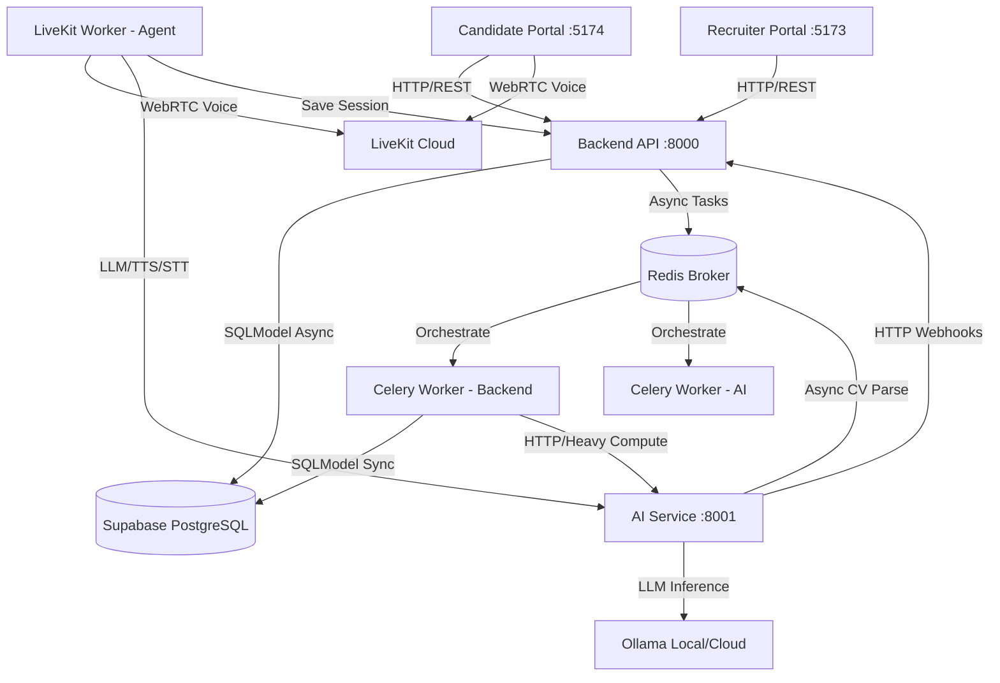

# EraMatch — AI-Powered Recruitment Platform

EraMatch is a **multi-tenant AI-powered recruitment platform** built for organizations to run structured, automated candidate evaluation pipelines. The system supports technical assessments, AI video interviews, and real-time live AI-conducted voice interviews with post-session scoring and explainable AI verdicts.

---

## Service Layout

All application services reside within the `EraMatch/` folder and can be launched together:

| Service | Path | Port | Stack | Description |
| :--- | :--- | :--- | :--- | :--- |
| **Recruiter Portal** | `Frontend/recruiter-portal/` | `5173` | React 18 + TS + Vite + Tailwind + shadcn/ui | Recruiter dashboard to create projects, positions, candidate groups, configure stages, and view scores. |
| **Candidate Portal** | `Frontend/candidate-portal/` | `5174` | React 18 + TS + Vite + Tailwind + shadcn/ui | Candidate dashboard for completing proctored assessments, recorded video interviews, and live WebRTC room interviews. |
| **Backend API** | `backend/` | `8000` | FastAPI + SQLModel + PostgreSQL + Celery | Core API handling business logic, database management, and asynchronous task dispatching. |
| **AI Service** | `ai-service/` | `8001` | FastAPI + Whisper + Ollama + LangChain | Heavy computational service managing local/cloud LLMs, Whisper transcription, and CV parsing. |
| **LiveKit Worker** | `ai-service/livekit_worker/` | — | Python LiveKit Agent | Live WebRTC assistant agent that connects directly to candidate rooms to conduct interviews. |

**Database**: Supabase PostgreSQL.

---

## System Architecture



---

## Directory Structure

Here is a high-level overview of the repository layout:

```
EraMatch/
├── Frontend/                    # Client-side applications
│   ├── recruiter-portal/        # Recruiter/Admin React dashboard
│   │   ├── src/                 # Components, hooks, router definitions, and API client
│   │   └── package.json
│   └── candidate-portal/        # Candidate evaluation portal
│       ├── src/                 # Proctoring checks, assessments, and interview rooms
│       └── package.json
├── backend/                     # FastAPI core backend service
│   ├── app/                     # Application logic
│   │   ├── api/                 # Endpoint routers (V1 API, auth, positions, groups)
│   │   ├── core/                # Configuration settings, exceptions, and security
│   │   ├── db/                  # Database connections and table initializations
│   │   ├── models.py            # Global domain tables & models (SQLModel)
│   │   ├── schemas/             # Pydantic data validation schemas
│   │   └── services/            # Business logic handlers
│   ├── worker/                  # Backend celery tasks (ingestion, QAG scoring)
│   └── pyproject.toml
├── ai-service/                  # Heavy computational AI endpoints
│   ├── main.py                  # API endpoints (STT, LLM evaluators, CV parsing)
│   ├── livekit_worker/          # Real-time WebRTC LiveKit agent code
│   ├── worker/                  # AI async celery tasks (CV parsing worker)
│   └── pyproject.toml
├── scripts/                     # Setup and management utility scripts
├── start.sh                     # Services combined launcher with log streaming
└── start-dev.sh                 # Developer port-clearing orchestrator (macOS/Linux)
```

---

## Quick Start

### 1. Prerequisites
Ensure you have the following installed:
- Node.js 18+
- Python 3.9+
- Redis Server (Required for Celery tasks)

### 2. Run Redis
```bash
brew services start redis           # macOS
sudo systemctl start redis-server   # Linux
```

### 3. Launch Services
From the `EraMatch/` root directory:
```bash
# Start all 5 services with log streaming
./start.sh

# Stop all services
./start.sh stop

# Tail the logs manually
./start.sh logs
```

---

## Git Workflow & Branching Rules

### Branch Naming Conventions
Always create feature/fix branches using the following format:
* **Features**: `feat/{issue-number}-{short-description}`
* **Bug Fixes**: `fix/{issue-number}-{short-description}`
* **Policies/Regulations**: `regulation/{short-description}`
* **Others**: `other/{short-description}`

### Commit Message Conventions
Commit messages must follow the standard prefixes matching your branch type, written in lowercase:
* **Format**: `<type>: <concise description>` (e.g. `feat: implement prescore v2 calculation formula`)
* Mention the issue driving the edit and list key technical changes in the body only when necessary.
* **CRITICAL**: Do **NOT** include `"Co-authored-by: Claude"` or any other AI authorship attribution in your commits.

### Development-Phase File Policy
To maintain codebase cleanliness, never commit draft spec files, brainstorming logs, or agent documentation files to Git. 
* All development temporary notes must reside under `Dev_temp_files/` (which is configured in `.gitignore`).
* Formal test suites (under `tests/`) are considered production verification tools and **must** be committed.
