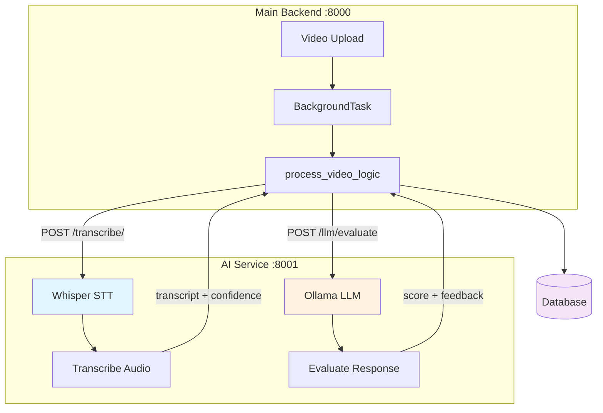

# AI Service - Video Interview Processing

**Separate microservice** for AI model inference, isolating heavy compute workloads from the main backend.

---

## Why a Separate AI Service Layer?

### Architectural Benefit
### Current Setup

```
┌─────────────────────────────────────────────────────────┐
│ Main Backend (:8000)                                    │
│ - Lightweight business logic                            │
│ - Database operations                                   │
│ - Authentication                                        │
│ - File uploads                                          │
└─────────────────┬───────────────────────────────────────┘
                  │ HTTP Calls
                  ↓
┌─────────────────────────────────────────────────────────┐
│ AI-Service (:8001)                                      │
│ - Whisper STT (local CPU/GPU)                           │
│ - Ollama LLM (cloud API)                                │
│ - Future: Image analysis, resume parsing, etc.         │
└─────────────────────────────────────────────────────────┘
```

**Key Principle**: Main backend sends tasks → AI service processes → Returns results

---

## Architecture Flow



---

## Services

### 1. **Whisper Transcription** (`/transcribe/`)
- **Model**: `faster-whisper` (small) - **Local inference** (CPU/GPU)
- **Deployment**: Runs on AI-service server (downloads model on first use)
- **Input**: Audio/video URL or base64
- **Output**: Transcript, confidence, duration
- **Performance**: ~8-12s for 120s video (CPU), ~3-5s (GPU)

### 2. **LLM Evaluation** (`/llm/evaluate`)
- **Model**: Gemma3 4B - **Cloud API** (Ollama Cloud)
- **Deployment**: Hosted by Ollama (https://ollama.com)
- **Input**: Transcript, question, reference answer
- **Output**: Score (0-100), detailed feedback
- **Performance**: ~2-4s per evaluation

---

## Running Locally

### 1. Install Dependencies
```bash
cd ai-service
uv sync
```

### 2. Configure `.env`
```env
USE_MOCK=false
OLLAMA_HOST=https://ollama.com
OLLAMA_API_KEY=your-api-key
OLLAMA_MODEL=gemma3:4b-cloud
WHISPER_MODEL=small
WHISPER_DEVICE=cpu
WHISPER_COMPUTE_TYPE=int8
```

Real question generation now uses Ollama by default. Keep `USE_MOCK=false` and set a valid `OLLAMA_API_KEY` if you want live model output. Set `USE_MOCK=true` only when you explicitly want a local fallback for UI/testing.

### 3. Start Service
```bash
uv run uvicorn main:app --reload --port 8001
```

---

## Model Deployment Options

### Current Setup (Production)

| Model | Deployment | Location | Cost |
|-------|------------|----------|------|
| **Whisper** | Local | AI-service server | Free (compute only) |
| **Gemma3 LLM** | Cloud API | Ollama Cloud | Pay-per-use |

### Whisper (Local Inference)

**Already running locally** - downloads automatically on first use:
- **Models stored**: `~/.cache/huggingface/hub/`
- **Available sizes**: `tiny`, `base`, `small`, `medium`, `large-v2`

**Change model** in `.env`:
```env
WHISPER_MODEL=medium  # Better accuracy, slower
WHISPER_DEVICE=cuda   # Use GPU if available
WHISPER_COMPUTE_TYPE=float16  # GPU precision
```

### Ollama LLM (Cloud API)

**Currently using Ollama Cloud** (not local):
- **Endpoint**: `https://ollama.com`
- **Authentication**: API key required
- **Models**: Gemma3, Llama3, Mistral, etc.

**Get API Key**: https://ollama.com/settings/keys

**Configuration** (`.env`):
```env
OLLAMA_HOST=https://ollama.com
OLLAMA_API_KEY=your-api-key-here
OLLAMA_MODEL=gemma3:4b-cloud
```

**Alternative Cloud Providers**:
- OpenAI GPT-4: Modify `services/ollama.py` to use OpenAI SDK
- Anthropic Claude: Use `anthropic` library
- Google Gemini: Use `google-generativeai` library

---

## Adding New AI Features

### Quick Integration Guide

**Use Case**: Backend needs AI processing (e.g., resume parsing, sentiment analysis)

#### Step 1: Add Endpoint to AI-Service

Create `ai-service/routers/your_feature.py`:
```python
from fastapi import APIRouter
from pydantic import BaseModel

router = APIRouter()

class YourRequest(BaseModel):
    input_data: str

class YourResponse(BaseModel):
    result: str
    confidence: float

@router.post("/your-feature/", response_model=YourResponse)
async def process_feature(request: YourRequest):
    # Your AI logic here
    result = your_ai_function(request.input_data)
    return YourResponse(result=result, confidence=0.95)
```

Register in `ai-service/main.py`:
```python
from routers import your_feature
app.include_router(your_feature.router, prefix="/your-feature", tags=["Your Feature"])
```

#### Step 2: Call from Backend

In your backend route or worker:
```python
import httpx
from app.core.config import settings

async def process_with_ai(data: str):
    async with httpx.AsyncClient() as client:
        response = await client.post(
            f"{settings.AI_SERVICE_URL}/your-feature/",
            json={"input_data": data},
            timeout=30.0
        )
        response.raise_for_status()
        return response.json()

# Usage in endpoint
@router.post("/analyze")
async def analyze_something(data: str):
    ai_result = await process_with_ai(data)
    # Store in DB, return to user, etc.
    return {"analysis": ai_result}
```

#### Step 3: Background Processing (Optional)

For long-running tasks, use BackgroundTasks:
```python
from fastapi import BackgroundTasks

def ai_processing_task(item_id: str, data: str):
    # Call AI service
    result = httpx.post(f"{AI_SERVICE_URL}/your-feature/", json={"input_data": data})
    
    # Update database
    db.execute("UPDATE items SET result = :result WHERE id = :id", 
               {"result": result.json(), "id": item_id})

@router.post("/process")
async def process_item(data: str, background_tasks: BackgroundTasks):
    item_id = create_item(data)
    background_tasks.add_task(ai_processing_task, item_id, data)
    return {"status": "processing", "item_id": item_id}
```

### Example Use Cases

| Feature | AI-Service Endpoint | Backend Usage |
|---------|---------------------|---------------|
| Resume parsing | `POST /parse-resume/` | Extract skills, experience from PDF |
| Sentiment analysis | `POST /sentiment/` | Analyze candidate feedback |
| Code evaluation | `POST /evaluate-code/` | Score coding challenge submissions |
| Image verification | `POST /verify-photo/` | Detect fake profile pictures |

---

## API Endpoints

### `POST /transcribe/`
```json
{
  "audio_url": "http://example.com/video.mp4",
  "language": "en"
}
```

**Response:**
```json
{
  "transcript": "This is the transcribed text...",
  "confidence": 0.95,
  "duration": 45.2,
  "language": "en"
}
```

---

### `POST /llm/evaluate`
```json
{
  "transcript": "I ensure code quality through...",
  "question": "How do you ensure code quality?",
  "reference_answer": "Testing, code review, CI/CD"
}
```

**Response:**
```json
{
  "score": 85.0,
  "feedback": "Strong answer covering testing and review..."
}
```

---

## Production Deployment

### Requirements
- **CPU**: 4+ cores (Whisper inference)
- **RAM**: 8GB+ (model loading)
- **GPU**: Optional (set `WHISPER_DEVICE=cuda`)

### Environment Variables
```env
USE_MOCK=false
OLLAMA_HOST=https://your-ollama-instance.com
OLLAMA_API_KEY=prod-key
GITHUB_TOKEN=ghp_xxx
DEBUG=false
```

Set `GITHUB_TOKEN` in the AI service environment to improve GitHub API reliability and reduce rate-limit failures during analysis.

### Docker (Future)
```dockerfile
FROM python:3.11-slim
WORKDIR /app
COPY . .
RUN pip install -r requirements.txt
CMD ["uvicorn", "main:app", "--host", "0.0.0.0", "--port", "8001"]
```

---

## Performance

| Operation | Time | Model |
|-----------|------|-------|
| Transcription (120s video) | ~8-12s | Whisper small (CPU) |
| LLM Evaluation | ~2-4s | Gemma3 4B (Cloud) |
| **Total Processing** | **~10-16s** | - |

**Optimization tips:**
- Use GPU for Whisper: 3-5x faster
- Switch to `tiny` model: 2x faster, slightly lower accuracy
- Cache common evaluations

---

## Troubleshooting

### "faster-whisper not installed"
```bash
uv add faster-whisper
```

### "Ollama connection refused"
Check Ollama is running:
```bash
curl http://localhost:11434/api/tags
```

### "CUDA out of memory"
Switch to CPU:
```env
WHISPER_DEVICE=cpu
```

---

## Tech Stack

- **Framework**: FastAPI
- **STT**: faster-whisper (OpenAI Whisper)
- **LLM**: Ollama (Gemma3, Llama3, etc.)
- **HTTP Client**: httpx
- **Config**: pydantic-settings
